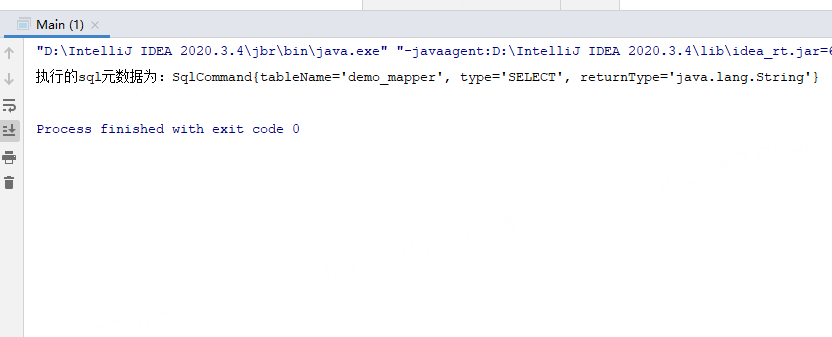
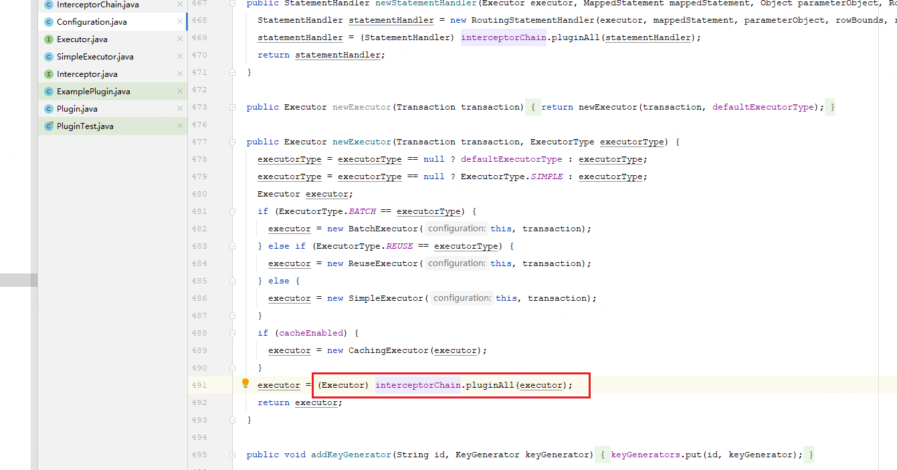
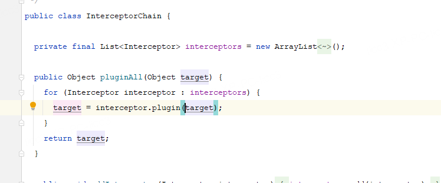
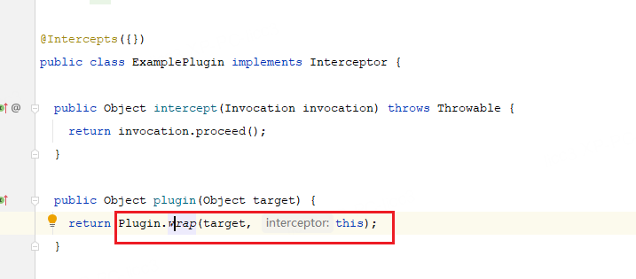
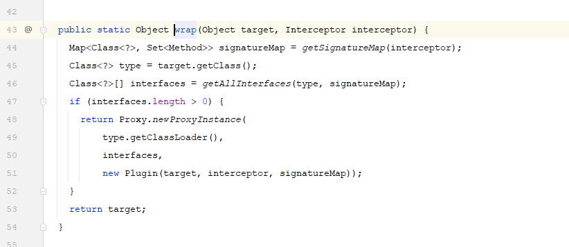
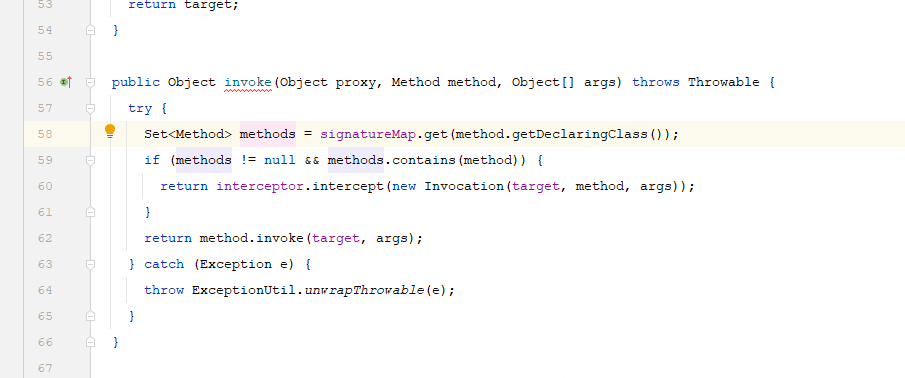
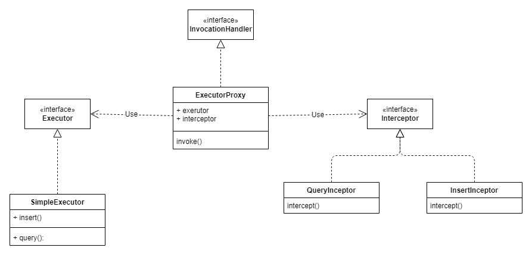

# 分析Mybatis动态代理应用

## 1. 动态代理demo

### 1.1 实现`InvocationHandler`

```java
public class MyInvocation implements InvocationHandler {
    @Override
    public Object invoke(Object o, Method method, Object[] objects) throws Throwable {
        System.out.println("动态代理类调用了：【" + method.getName() + "】方法");
        return null;
    }
}
```

### 1.2 定义需要代理的类

```java
public interface UserService {
    /**
     * 获取用户名称
     * @param uesrname
     * @return
     */
    String getUsername(String uesrname);
}
```

### 1.3 调用方法`Proxy.*newProxyInstance*`

```java
public static void main(String[] args) {
        Class[] classes = new Class[]{UserService.class};
        UserService instance = (UserService)Proxy.newProxyInstance(UserService.class.getClassLoader(), classes, new MyInvocation());
        instance.getUsername("achao");
        System.out.println(instance.getClass());
    }
```

显示调用成功


## 2. 动态代理应用

    在mybatis中，使用到了很多的动态代理，用来获取maper，完成拦截器的功能。

### 2.1 mybatis中mapper代理分析

    mybatis中获取到了sqlSession对象后，便使用`sqlSession.getMapper`获取mapper，这里便使用到了动态代理。

    mybatis中主要通过`MapperProxy`实现了`InvocationHandler`,  和封装的`MapperMethod`来完成调用mapper方法实现sql查询。

**MapperProxy**

```java
  public Object invoke(Object proxy, Method method, Object[] args) throws Throwable {
    if (Object.class.equals(method.getDeclaringClass())) {
      try {
        return method.invoke(this, args);
      } catch (Throwable t) {
        throw ExceptionUtil.unwrapThrowable(t);
      }
    }
    final MapperMethod mapperMethod = cachedMapperMethod(method);
    return mapperMethod.execute(sqlSession, args);
  }
```

**MapperMethod**

```java
public class MapperMethod {

  private final SqlCommand command;
  private final MethodSignature method;

  // 封装了代理对象的类信息，方法信息，sql配置信息
  public MapperMethod(Class<?> mapperInterface, Method method, Configuration config) {
    this.command = new SqlCommand(config, mapperInterface, method);
    this.method = new MethodSignature(config, method);
  }

// 其他方法省略
}
```

    猜测上，是通过解析接口的注解信息，完成对应sql的执行。下面，通过一个demo来模仿这种应用。


### 2.2 模仿mapper代理

- 首先定义mapper
  
  两个注解也是自定义的，这里模拟一下mybatis的注解使用场景

```java
// 关联的数据库表名称
@Table(tableName = "demo_mapper")
public interface DemoMapper {

    /**
     * 普通查询方法
     * @return
     */
    @Type
    String select();
}
```

- 自定义invocation

```java
public class MapperInvocation implements InvocationHandler {
    @Override
    public Object invoke(Object o, Method method, Object[] objects) throws Throwable {
        if (Object.class.equals(method.getDeclaringClass())) {
            // toString, equals等方法，直接调用本方法
            return method.invoke(this, objects);
        }
        // 调用的方法，通过mapperMethod解析
        MapperMethod mapperMethod = new MapperMethod(o.getClass().getInterfaces()[0], method, objects);
        return mapperMethod.invoke();
    }
}
```

- 定义mapperMethod用来解析

```java
public class MapperMethod {
    private Class mapperClass;

    private Method method;

    private Object[] args;

    private SqlCommand sqlCommand;

    public MapperMethod(Class mapperClass, Method method, Object[] args) {
        this.mapperClass = mapperClass;
        this.method = method;
        this.args = args;
        innit();
    }

    private void innit() {
        // 解析代理目标接口的注解信息
        Table table = (Table) mapperClass.getDeclaredAnnotation(Table.class);
        // 获取注解关联的表名称

        // 获取查询类型
        Type type = method.getDeclaredAnnotation(Type.class);
        type.type();

        Class<?> returnType = method.getReturnType();
        // 执行器
        this.sqlCommand = new SqlCommand(table.tableName(), type.type(), returnType.getTypeName());

    }

    public Object invoke() {
        System.out.println(sqlCommand);
        return null;
    }

    class SqlCommand {
        String tableName;

        String type;

        String returnType;

        public SqlCommand(String tableName, String type, String returnType) {
            this.tableName = tableName;
            this.type = type;
            this.returnType = returnType;
        }

        @Override
        public String toString() {
            return "执行的sql元数据为：SqlCommand{" +
                    "tableName='" + tableName + '\'' +
                    ", type='" + type + '\'' +
                    ", returnType='" + returnType + '\'' +
                    '}';
        }
    }
}
```

- 定义factory统一入口

```java
public class MapperProxyFactory {

    private static final MapperInvocation mapperInvocation = new MapperInvocation();

    /**
     * 获取mapper动态代理类
     * @param tClass
     * @param <T>
     * @return
     */
    public static <T> T getMapper(Class<T> tClass) {
        return (T) Proxy.newProxyInstance(MapperProxyFactory.class.getClassLoader(), new Class[]{tClass}, mapperInvocation);
    }

}
```

- 实现效果

```java
    public static void main(String[] args) {
        DemoMapper demoMapper = MapperProxyFactory.getMapper(DemoMapper.class);
        demoMapper.select();
    }
```




### 2.3 拦截器代理分析

    这部分内容我是比较好奇的，再看了相关的文章，说mybatis的拦截器，是在executor，ResultSetHandler的动态代理中进行拦截的。疑问点在于，动态代理的对象是接口，并不是定义的实体类，也不是抽象类，怎么能在executor真实方法调用接口进行拦截呢。

    带着上述疑问，打开mybatis源码进行研究。

**InterceptorChain**



mybatis在创建执行器的时候，使用InterceptorChain对executor**子类对象**进行处理后返回。这里面便使用了代理。



这个类里面，注入了所有定义的拦截器，并循环对executor进行了代理。具体看下面的这个示例插件。


**ExamplePlugin**



**Plugin**



这个类实现了`InvocationHandler`，并对代理对象的注解进行了解析(拦截哪些类，拦截哪些方法)，最后将支持拦截的接口（interfaces）进行动态代理返回。



这里关键的两段逻辑是，对进来的方法判断需不需要拦击器处理。然后再调用真实对象(target)的方法。


**看到这里就明白了，实际上mybatis执行的executor是一个动态代理的对象，并且，这是根据拦截器数量，返回的多层动态代理。**


### 2.4 模仿拦截器代理

先画一个UML图吧



核心的类图是这样的，当然还需要注解，和创建Executor工厂类。


**ExecutorFactory**

```java
public class ExecutorFactory {

    public static Executor newExecutor() {
        // 代理目标执行器实例
        SimpleExecutor executor = new SimpleExecutor();
        // 两个拦截器
        QueryInterceptor queryInterceptor = new QueryInterceptor();
        InsertInterceptor insertInterceptor = new InsertInterceptor();
        List<Interceptor> interceptors = new ArrayList<>(2);
        interceptors.add(queryInterceptor);
        interceptors.add(insertInterceptor);
        InterceptorChain interceptorChain = new InterceptorChain(interceptors);
        // 生成代理执行器
        return interceptorChain.plugin(executor);
    }
}
```


**InterceptorChain**

```java
public class InterceptorChain {
    private List<Interceptor> interceptors;

    public InterceptorChain(List<Interceptor> interceptors) {
        this.interceptors = interceptors;
    }


    public Executor plugin(Executor executor) {
        for (Interceptor interceptor : interceptors) {
            // 循环返回代理对象，套娃
            executor = interceptor.wrap(executor);
        }
        return executor;
    }
}
```


**AbstractInterceptor**

```java
public abstract class AbstractInterceptor implements Interceptor{
    /**
     * 生成代理对象
     * @param executor
     * @return
     */
    @Override
    public Executor wrap(Executor executor) {
        InterceptorClass annotation = this.getClass().getAnnotation(InterceptorClass.class);
        if (annotation == null || annotation.methods().length == 0) {
            // 不进行代理
            return executor;
        }

        // 能够代理的类
        Class[] interfaces = annotation.targets();
        return (Executor) Proxy.newProxyInstance(
                Executor.class.getClassLoader(),
                interfaces,
                new ExecutorProxy(executor, this, Arrays.stream(annotation.methods()).collect(Collectors.toSet())));
    }
}
```


**ExecutorProxy**

```java
public class ExecutorProxy implements InvocationHandler {

    private Object target;

    private Interceptor interceptor;

    private Set<String> supportMethods;

    public ExecutorProxy(Object target, Interceptor interceptor, Set<String> supportMethods) {
        this.target = target;
        this.interceptor = interceptor;
        this.supportMethods = supportMethods;
    }

    @Override
    public Object invoke(Object o, Method method, Object[] objects) throws Throwable {
        // 执行拦截器方法
        if (supportMethods.contains(method.getName())) {
            return interceptor.intercept(new Invocation(target, method, objects));
        }
        return method.invoke(target, objects);
    }
}
```


## 3. 总结

    实际上，java代理可以实现对接口和普通类的代理，虽然官方方法`Proxy.newInstance`只支持传入接口类型类，但是同样可以对实例对象传递，在invoke执行时，调用真实对象的方法。
